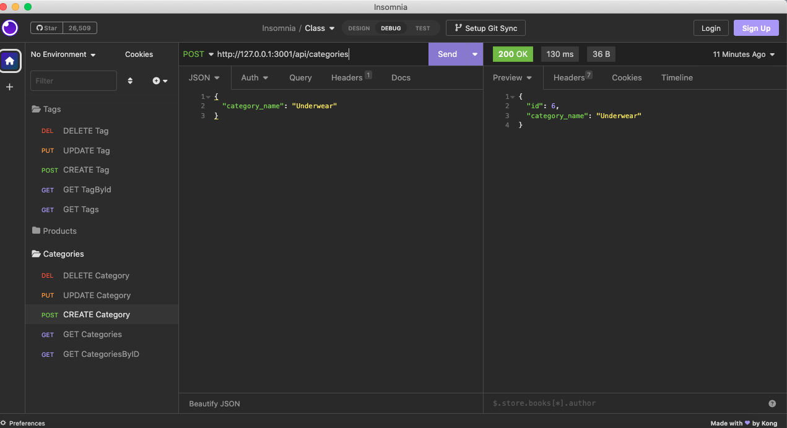

# elite-ecommerce-backend

## Description

This is the backend of an internet retail company's e-commerce website. It provides buisnesses a full suite of data storage solutions that will enable commerce.

## Table of Contents

- [Installation](#installation)
- [Usage](#usage)
- [VideoDemo](#video-demo)
- [License](#license)
- [Contributing](#contributing)
- [Tests](#tests)
- [Questions](#questions)

## Installation

To install clone the githib repo, run npm install, the  run the package.

## Usage

ensure that you have mysql installed in your system.

## Video-Demo

URL: [DemoVideo](https://drive.google.com/file/d/18e0W0e4wdLLnRSiLYWk14zxnGlPBajTI/view)

## License

This project is covered under the following: MIT License

## Contributing

To contribute submit an issue of the projects GitHub repo page.

## Tests

N/A

## Questions

Direct all questions to: rafael.barbosa51@gmail.com

Github User Name: rbarbosa51

Github Profile URL: https://github.com/rbarbosa51
